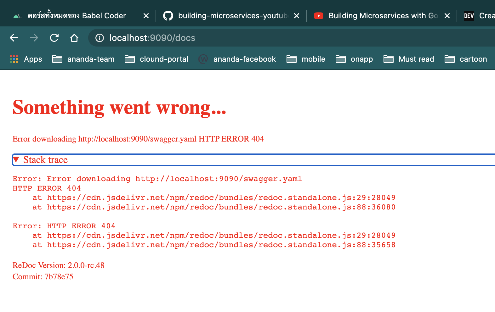

# updev-go-product-api
Example project with Nic Jackson (https://www.youtube.com/watch?v=VzBGi_n65iU&amp;t=485s&amp;ab_channel=NicJackson)

## get start ep1

Found error ``import net/http `` เกี่ยวกับการ Import นั้นแสดงว่าคุณยังไม่ได้ทำการกำหนด ``GO module``

และนีคือขั้นตอนในการกำหนด go module
    
```
go mod init github.com/ksupdev/updev-go-product-api
```

และ Error ที่เจอก่อนหน้าก็จะหายไป

> กรณีที่เราต้องทำการพัฒนา GO ด้านนนอก GO workspace จะต้องมีการนำ go module มาช่วยในการพัฒนา

ลองทำการ run server ของเราโดยการใช้

```
    go run main.go
```

และมา ``CURL`` กันหน่อย

``` powersshell
    curl -v localhost:9090
    *   Trying ::1...
    * TCP_NODELAY set
    * Connected to localhost (::1) port 9090 (#0)
    > GET / HTTP/1.1
    > Host: localhost:9090
    > User-Agent: curl/7.64.1
    > Accept: */*
    > 
    < HTTP/1.1 404 Not Found
    < Content-Type: text/plain; charset=utf-8
    < X-Content-Type-Options: nosniff
    < Date: Tue, 23 Mar 2021 06:16:02 GMT
    < Content-Length: 19
    < 
    404 page not found
    * Connection #0 to host localhost left intact
    * Closing connection 0
```

> log.Println("Hello world") จะเป็น Command สำหรับการแสดงผลผ่าน Terminal ตัวอย่างข้อมูล ``2021/03/23 13:24:39 Hello world``

> ถ้าเราทำการกำหนด ``http.HandleFunc("/"..... `` นั้นจะหมายความว่าไม่ว่ามันจะเป็น default request หรือก็คือถ้าไม่ตรงกับใครก็จะมาที่เรานี้เอง

เราสามารถใช้ ``d, _ := ioutil.ReadAll(r.Body)`` สำหรับการอ่านค่า Request body เพื่อนำมาแสดงใน log ได้
```go
http.HandleFunc("/", func(rw http.ResponseWriter, r *http.Request) {
		log.Println("Hello world")
		d, _ := ioutil.ReadAll(r.Body)

		log.Printf("Data %s\n", d)
})
```

ทดสอบการ request โดยให้มีการโยน body data มาด้วย
```powershell
    curl -v -d 'pu' localhost:9090
    ..
    ..
    ..
    //output
    2021/03/24 23:52:34 Data pu
```

> ในการที่เราจะ write log เพื่อแสดงผลใน terminal เราสามารถใช้ ``log.Printf("",.....)`` แต่ถ้าเราต้องการให้มีการ write log แทนที่จะผ่าน terminal แต่ให้ Response กลับไปที่ user เราก็สามารถใช้ ``rw http.ResponseWriter`` และ ``fmt.Fprintf()`` สำหรับกำหนด format ของข้อมูล เพื่อ Response กลับไป

## ep2
    เราทำการแยกการทำงานของ Hello และ Good bye ออกจาก ``main.go`` แลำทำการสร้างของ package ``handlers`` เพื่อทำการเก็บ Hello,GoodBye 

    > การในส่วนของ http.Handler มีการกำหนด interface ในภาษา GO มันไม่จำเป็นที่ต้องมีการระบุว่า func ของเรานั้น Implement interface ไหน Go จะสนใจแค่ว่าขอให้มี ชื่อและ parameter ให้ตรงตาม interface ก็จะสามารถใช้งานได้ทันที

```GO
[filename : server.go]
package http

type Handler interface {
    ServeHTTP(ResponseWriter, *Request)
}
// ----- end file
[filename : hello.go]
type Hello struct {
    ......
}

func NewHello(l *log.Logger) *Hello {
    ......
}
// create func has structure same Interface http.Handler
func (h *Hello) ServeHTTP(rw http.ResponseWriter, r *http.Request) {
    .......
}

// ----- end file

[filename : main.go]

l := log.New(os.Stdout, "product-api", log.LstdFlags)
hh := handlers.NewHello(l)

sm := http.NewServeMux()
//Method Handle requir string parameter and Interface http.Handler
sm.Handle("/", hh)

```

จากตัวอย่างเราจะเห็นว่าถ้ามีทำการ implement func ServeHTTP สำหรับ Hello เราก็จะไม่สามารถทำการ mapping request กับ Hello action ได้


> sig := <-sigChain ref https://tour.golang.org/concurrency/2
```GO
	sigChain := make(chan os.Signal)
	signal.Notify(sigChain, os.Interrupt)
	signal.Notify(sigChain, os.Kill)

	sig := <-sigChain
	l.Println("Recieved terminal , graceful shutdown", sig)
```

> channel : คือวิธีในการนำค่าออกมาจาก go Routines โดยเราสามารถสร้าง channel โดยใช้ ``sigChain := make(chan os.Signal)`` และเราสามารถทำการ set ค่าใส่ channel โดยใช้ ``sigChain <- value ....`` และเราสามารถเอาค่าออกจาก channel โดยใช้ `` sig := <-sigChain``

## ep3
> REST : Representational State Transfer (REST)

เราสามารถทำการ Convert struct array to json โดยใช้ ``json.Marshal(.. data ..)`` 
``` GO
    [filename:./data/products.go]
    func GetProducts() []*Product {
	return productList
    }

    ----- end file ----
    [filename:./handler/products.go]

    func (p *Products) ServeHTTP(rw http.ResponseWriter, r *http.Request) {
        lp := data.GetProducts()

        d, err := json.Marshal(lp)
        if err != nil {
            http.Error(rw, "Unable to marshal json", http.StatusInternalServerError)
        }

        rw.Write(d)

    }

```

การเลือกใช้ convert JSON
> The only difference is if you want to play with string or bytes use marshal, and if any data you want to read or write to some writer interface, use encodes and decode. [ref](https://stackoverflow.com/questions/33061117/in-golang-what-is-the-difference-between-json-encoding-and-marshalling#:~:text=Marshal%20and%20Unmarshal%20convert%20a,into%20JSON%20and%20vice%20versa.&text=The%20only%20difference%20is%20if,interface%2C%20use%20encodes%20and%20decode.)

## ep4 (Implement rest without framework)
test with post method 

``` powershell
curl http://localhost:9090 -d '{"id":1, "name":"tea", "description":"a nice cup of tea"}' 
curl -v http://localhost:9090/1 -XPUT -d '{ "name":"update tea", "description":"a nice cup of tea"}'
```

## ep5 Implement rest with framwork
    implement with Gorilla framework
    ``go get github.com/gorilla/mux``

## ep6 JSON Validation
implement go validation
    ``go get github.com/go-playground/validator/v10``

- error case
    ``` powershell
    ----- request -----
    curl -v http://localhost:9090/4 -X PUT -d '{ "name":"55555", "description":"a nice cup of tea"}'

    ----- ouput -----

    Unable to validate product : Key: 'Product.Price' Error:Field validation for 'Price' failed on the 'gt' tag
    Key: 'Product.SKU' Error:Field validation for 'SKU' failed on the 'required' tag

    ```
- success case

    ```powershell
    ----- request -----
    curl -v http://localhost:9090/4 -X PUT -d '{ "name":"55555", "description":"a nice cup of tea","sku":"abc-abc-abc","price":1}'

    ```

## ep7 Create swagger document
> http://localhost:9090/docs
Before create file, you must have to install 

> swagger doc [REF](https://goswagger.io/)

```powershell
    brew tap go-swagger/go-swagger
    brew install go-swagger
```
- create comment in ``./handlers/products.go`` at top level
- create ``MakeFile`` at root project
- run command ``make swagger``

ทำการสร้าง struct สำหรับช่วยในการ Defind document ของเรา เพราะจริงๆแล้วในส่วนของการ Response ของเรานั้นไม่ได้ใช้ Struct ตัวนี้แต่ใช้ โครงสร้างที่มีลักษณะเดียวกัน ``GetProducts()``
```go
[fileName : ./handlers/products.go]
// A list of products
// swagger:response productsResponse
type productsResponseWrapprt struct {
	// All current products
	// in: body
	Body []data.Product
}

[fileName : ./data/products.go]
func GetProducts() Products {
	return productList
    // var productList []*Product
}
```

คำสั้งเกี่ยวกับการ generate swagger ล่าสุดพบว่า

```go
[file: Makefile]
check_install:
    which swagger || GO111MODULE=off go get -u github.com/go-swagger/go-swagger/cmd/swagger

swagger: check_install
    GO111MODULE=off swagger generate spec -o ./swagger.yaml --scan-models

--- Error ----
karoon@Nuttakorns-MacBook-Pro updev-go-product-api % make swagger
which swagger || GO111MODULE=off go get -u github.com/go-swagger/go-swagger/cmd/swagger
/usr/local/bin/swagger
GO111MODULE=off swagger generate spec -o ./swagger.yaml --scan-models
unsupported type "invalid type"
make: *** [swagger] Error 1
```

ไม่สามารถ genereate swagger ได้ในบ้าง tage ``swagger:response productsResponse`` พอลองไปหาตาม google พบว่ามีคนแนะนำให้ทำการ remove ``GO111MODULE=off`` ออกสำหรับในส่วนของ swagger จึงสามารถใช้งานได้ปกติ
```go
[file: Makefile]
check_install:
    which swagger || GO111MODULE=off go get -u github.com/go-swagger/go-swagger/cmd/swagger

swagger: check_install
    swagger generate spec -o ./swagger.yaml --scan-models

---- Messge ----
karoon@Nuttakorns-MacBook-Pro updev-go-product-api % make swagger
which swagger || GO111MODULE=off go get -u github.com/go-swagger/go-swagger/cmd/swagger
/usr/local/bin/swagger
swagger generate spec -o ./swagger.yaml --scan-models
```

- Implement Doc open api ReDoc [redoc](https://github.com/Redocly) : ทำการ Install  https://github.com/go-openapi/runtime
    ```powershell
    go get github.com/go-openapi/runtime/middleware
    <!-- go get package github.com/go-openapi/runtime/middleware -->
    go mod vendor
    ```
- ทำการ run ``go run main.go`` และทำการเปิด ``http://localhost:9090/docs``

    
    เนื่องจากในส่วนของ Redoc เองก็เป็น Javascript Framework และเมื่อพยายามจะ download ``swagger.yml`` จึงไม่สามารถทำการ Donwload จะต้องมีการ config ในส่วนของ CORS ก่อน
    ``Error downloading http://localhost:9090/swagger.yaml HTTP ERROR 404``

    แต่เพื่อเป็นการปัญหาชั่วคราว เลยทำการ mapping request ตรงไปที่ directory เลย
    ``getRouter.Handle("/swagger.yaml", http.FileServer(http.Dir("./")))``

> ``go mod vendor`` ,``go mod tidy``

> ``strconv`` Package strconv implements conversions to and from string representations of basic data types. [REF](https://golang.org/pkg/strconv/) 


- fix bugs

```golang

----- original ------
// Create handles POST requests to add new products
func (p *Products) Create(rw http.ResponseWriter, r *http.Request) {
	// fetch the product from the context
	prod := r.Context().Value(KeyProduct{}).(data.Product)

	p.l.Printf("[DEBUG] Inserting product: %#v\n", prod)
	data.AddProduct(prod)
}
------- output -------

http: panic serving [::1]:50890: interface conversion: interface {} is *data.Product, not data.Product


```

จากการหาข้อมูลพบว่า error นี้ส่วนมากจะเกิดจากการที่เราจะ convert interface{} ไปยังอีก data type สิ่งที่เราควรทำคือจะต้องแน่ใจก่อนว่า ``value ที่ส่งมานั้น มี data type ถูกต้องหรือเปล่า``

```golang
----- new version ----
unc (p *Products) Create(rw http.ResponseWriter, r *http.Request) {
	// fetch the product from the context
	p.l.Println("------Handle Create------")
	prod := r.Context().Value(KeyProduct{})
	p.l.Println("------Check data type of value in interface------ ", reflect.TypeOf(prod))

	if _, ok := prod.(*data.Product); ok {
		p.l.Printf("[DEBUG] Inserting product: %#v\n", prod)
		data.AddProduct(*(prod.(*data.Product)))
	} else {
		p.l.Println("[ERROR] Not okay")
	}
}

```
เราเพิ่มในส่วนของ if เพื่อทำการตรวจสอบ datatype ของ value ว่่าเป็นไปตามที่เราคิดหรือเปล่าเพื่อป้องกันปัญหา
> ``reflect.TypeOf(prod) `` ใช้สำหรับ Check datatype of data
> ``*(prod.(*data.Product))`` ทำการ Convert pointer to value ที่เราต้อง Convert เพราะว่า data.AddProduct นั้นจะรับค่าเป็นแบบ value เท่านั้น

Install test package
```powershell
go get package github.com/stretchr/testify
go mod tidy
go mod vendor
```

### Easter Eggs
- go mod tidy : คำสั่งนี้มีไว้เพื่อช่วยในการลบ dependencies ที่ไม่ได้ต้องการใช้งานแล้ว โดยปกติ Go build จะแค่ทำการอัพเดท dependencies แต่จะไม่ต้องการลบอะไรที่เราไม่ได้ใช้งานแล้ว
- go mod vendor : ถ้าเราต้องการให้มีโฟลเดอร์​ vendor ในโปรเจคของเรา สามารถรันคำสั่งนี้เพื่อดาวโหลดทุก dependencies ที่เราเขียนไว้ใน go.mod มาเก็บไว้ในโฟลเดอร์ vendor ใน root โฟลเดอร์ของเรานั้นเอง สำหรับบางเคสที่ต้องการใช้งานนั้นเอง
